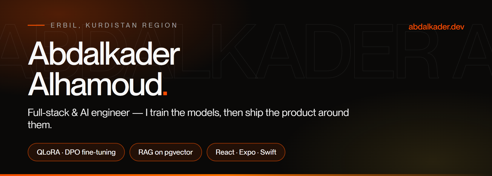

  

  <a href="https://abdalkader.dev"><b>abdalkader.dev</b></a> ·
  <a href="https://www.linkedin.com/in/abdalkaderdev">LinkedIn</a> ·
  <a href="mailto:hello@abdalkader.dev">hello@abdalkader.dev</a>

---

Most people building with LLMs call an API. I train the model, serve it, and build the product
around it — the retrieval layer, the backend, the web app, and the mobile app that ships to the
App Store.

Lead engineer at **Why Live Today LLC**, building **[GodFocus](https://platform.godfocus.io)**.
Also with **Mount Seir Tech**, **Disciple One**, **Natuzzi Erbil** and **Real House**, out of Erbil.

 

## What I'm building

### [GodFocus](https://platform.godfocus.io) — Bible search + RAG as a service

The models are mine, not rented. A **QLoRA** fine-tune, preference-aligned with **DPO**, adapters
merged and scored through a dedicated eval harness. Alongside it a custom **cross-encoder
reranker** trained with sentence-transformers and PyTorch, then exported to **ONNX** so it runs
inline in the request path instead of adding a network hop — cross-encoders rerank far better
than bi-encoders, and that export is what makes the accuracy affordable at request time. All of
it over a **pgvector** retrieval layer.

`Python` · `PyTorch` · `QLoRA` · `DPO` · `ONNX Runtime` · `pgvector` · `Ollama` — six repos: API, web, mobile, sites, docs

### [ParsaLink](https://parsalink.io) — AI CRM · *Mount Seir Tech*

**OpenAI, Anthropic and Google Gemini SDKs running side by side** in one Django 5 + DRF backend,
with an **MCP server** so agents can drive the CRM directly. Infrastructure is code: **Terraform**
across Cloudflare and Hostinger, managing DNS and preview environments. Plus a SvelteKit
marketing site and an Expo mobile CRM with biometric auth and offline-first caching.

`Django` · `DRF` · `PostgreSQL` · `Terraform` · `MCP` · `boto3` · `SvelteKit` · `Expo` — 495 commits

### [VIA](https://viaapp.life) + [Disciple One](https://discipleone.life) — live on the App Store

An eight-repo platform — API, web, admin, church dashboard, mobile, SDK, types, docs —
**1,114 commits**. The app is React Native, but the interesting part is native: I wrote the
**Live Activity and Dynamic Island** widget in Swift with ActivityKit and WidgetKit, plus two
Expo native modules to bridge it to JS. Live Activities render as snapshots, so the animation
has to be update-driven rather than a loop — that constraint shapes the whole widget.

`React Native` · `Expo` · `Swift` · `SwiftUI` · `ActivityKit` · `WidgetKit` · `EAS` · `Sentry` · `RevenueCat`

### [SoapBox](https://soapboxsuperapp.com) — platform engineering

SDK, [developer portal](https://builder.soapboxsuperapp.com) and cloud console — the surfaces
*other* engineers build against. Fine-tuned LLMs for product-specific use cases.

 

## Shipped and live

| | What it is | For |
|---|---|---|
| **[platform.godfocus.io](https://platform.godfocus.io)** | Bible search + RAG, on models I trained | Why Live Today |
| **[parsalink.io](https://parsalink.io)** | AI CRM — three LLM SDKs + MCP server | Mount Seir Tech |
| **[viaapp.life](https://viaapp.life)** | Devotional app — iOS, Android, web | Disciple One |
| **[discipleone.life](https://discipleone.life)** | Nonprofit platform + church dashboards | Disciple One |
| **[soapboxsuperapp.com](https://soapboxsuperapp.com)** | Faith community platform + SDK | SoapBox |
| **[phoenixerbil.com](https://phoenixerbil.com)** | Multilingual site + Odoo ERP work | Phoenix Tower |
| **[realhouseiq.com](https://realhouseiq.com)** · **[map](https://map.realhouseiq.com)** | Real estate site + property map | Real House |
| **[tunica.vercel.app](https://tunica.vercel.app/en)** | Multilingual brand site | client |
| **[familydentalcard.vip](https://familydentalcard.vip)** | Clinic site | client |
| **[hamiltoniq.com](https://hamiltoniq.com)** | Real estate platform | client |
| **[abdalkader.dev](https://abdalkader.dev)** | Portfolio | me |

 

## Stack

**AI/ML** — LLM fine-tuning (QLoRA, DPO) · custom reranker training · RAG architecture · pgvector ·
embeddings and semantic search · ONNX inference optimisation · MCP servers · OpenAI, Anthropic and
Google Gemini SDKs in production

**Languages** — Python · TypeScript · JavaScript · Swift · SQL

**Frontend** — React · Next.js · Svelte/SvelteKit · Astro · GSAP · Three.js · SCSS

**Mobile** — React Native (Expo) · expo-router · SwiftUI · WidgetKit · ActivityKit · EAS Build & Submit ·
in-app purchases · biometric auth · push notifications · offline-first sync

**Backend** — Node.js · Express · Django · DRF · FastAPI · REST · GraphQL · Prisma · WebSockets

**Infra** — Terraform (Cloudflare, Hostinger) · Docker · GitHub Actions · Caddy · Nginx · VPS ·
Cloudflare · AWS (boto3) · Vercel

**Data** — PostgreSQL · pgvector · MongoDB · Redis

 

## By the numbers

**6,300+** contributions in the last year · **41** repositories with my commits ·
**176** repositories · **6** organisations · **28** repos as an outside collaborator

Heaviest: Disciple One **1,114** · ParsaLink **495** · godfocus **377** · via-mobile **369** ·
Godfocus-api **189** · godfocus-mobile **159**

 

## Before software

Cell site technician for **MTN Syria** in Aleppo and **Zain Sudan** in Khartoum, 2015–2018,
installing and maintaining telecom infrastructure. I came to software properly in November 2023.
The telecom years are why I think about uptime before features.

 

---

  <a href="https://abdalkader.dev">abdalkader.dev</a> ·
  <a href="https://instagram.com/abdalkader.dev">Instagram</a> ·
  <a href="https://tiktok.com/@Abdalkader.dev">TikTok</a> ·
  <a href="https://buymeacoffee.com/abdalkader.dev">Buy me a coffee</a>

